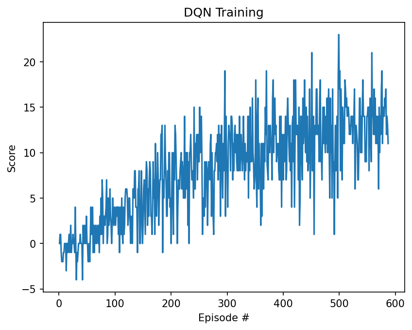

# Project 1 — Navigation (Banana Collector)

This repo contains my solution for Udacity’s Deep Reinforcement Learning Nanodegree **Project 1: Navigation**.

## Environment

The agent moves in a square world and collects bananas:

- **Reward:** +1 for a yellow banana, -1 for a blue banana  
- **State space:** 37 continuous values (velocity + ray-based perception)  
- **Action space:** 4 discrete actions (forward, backward, turn left, turn right)  
- **Solved when:** average score **>= +13** over **100** consecutive episodes

## Approach — Deep Q-Network (DQN)

I implemented a standard **DQN** agent in PyTorch with the common stability components:

- **Q-network** to approximate Q(s, a)
- **Replay buffer** to sample decorrelated mini-batches
- **Target network** to stabilize TD targets
- **Epsilon-greedy** exploration with decay

### Update rule (DQN)

For each transition `(state, action, reward, next_state, done)` sampled from the replay buffer:

- If the episode ended (`done = True`), the target is:
  - `target = reward`

- Otherwise, the target bootstraps from the target network:
  - `target = reward + gamma * max_a' Q_target(next_state, a')`

The local network predicts:
- `predicted = Q_local(state, action)`

Training minimizes the mean-squared TD error between `predicted` and `target`.

After each learning step, the target network is softly updated:
- `theta_target = tau * theta_local + (1 - tau) * theta_target`

## Hyperparameters

- **BUFFER_SIZE:** 100000  
- **BATCH_SIZE:** 64  
- **GAMMA:** 0.99  
- **TAU:** 1e-3  
- **LR:** 5e-4  
- **UPDATE_EVERY:** 4  
- **Epsilon schedule:** start 1.0 → end 0.01, decay 0.995  

## Neural network

Fully-connected MLP:

- Input: 37  
- Hidden: 64 (ReLU)  
- Hidden: 64 (ReLU)  
- Output: 4 (Q-values, one per action)

Architecture: **37 → 64 → 64 → 4**

## Results

The environment is solved when the average score over 100 consecutive episodes is **>= +13**.

My agent solved the environment in **583 episodes**, reaching an average score of **13.02** over the last 100 episodes.

Evaluation using the saved checkpoint (`checkpoint.pth`) achieved a mean score of **15.10** over 10 episodes.

